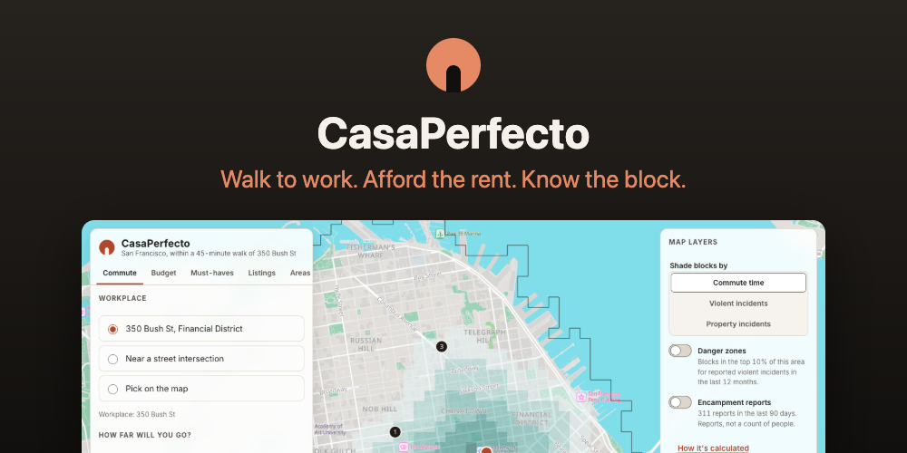
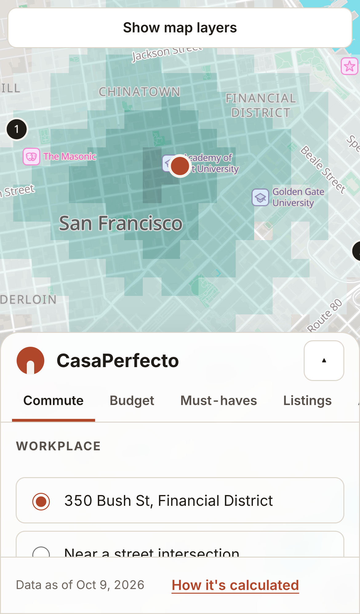
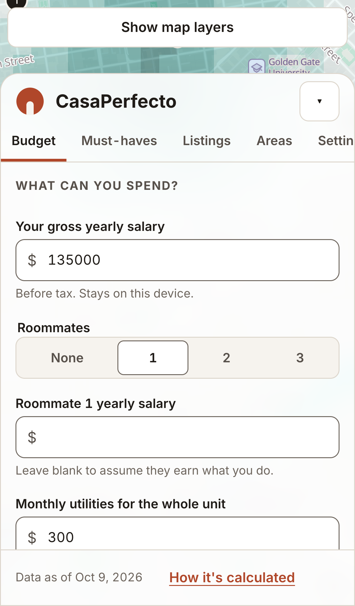
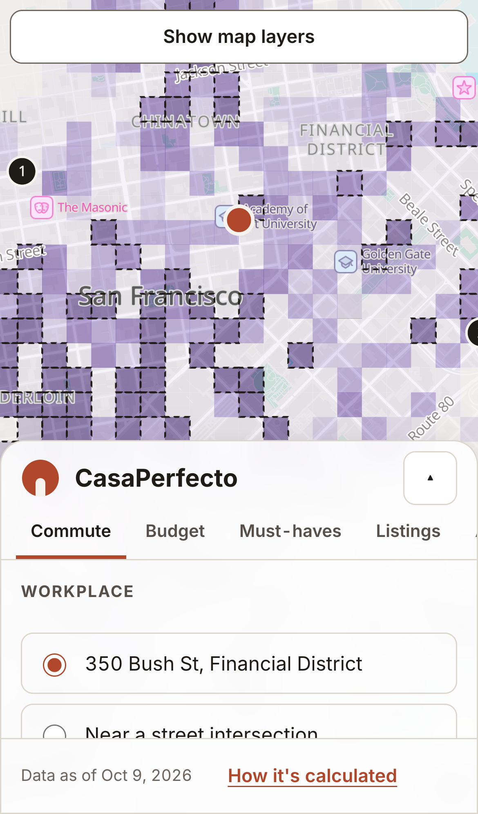
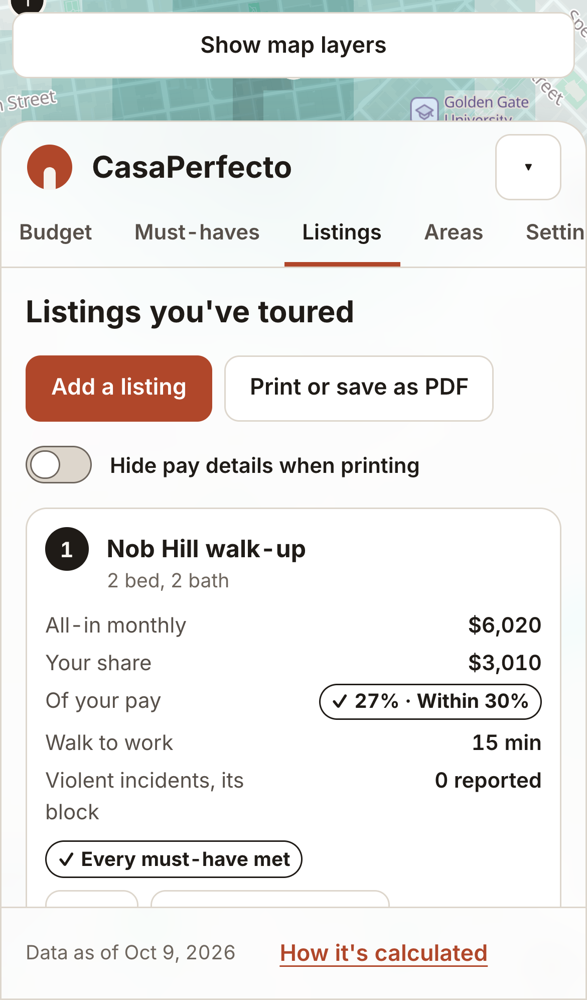

<div align="center">

# CasaPerfecto 🏡

<kbd>
    
</kbd>

## Project Description 🎨

CasaPerfecto is a private, map-based apartment search companion for renters who want to walk to work. Choose a workplace and a maximum commute, and the map shades every block you can reach on foot or by Muni, with hills included. Enter your salary to see the rent ceiling under the 30% affordability guideline, compare it with current median rents by unit type, and switch on layers for reported incidents and 311 encampment reports from San Francisco's open data. Rank your must-haves, log the listings you tour, and compare their all-in monthly cost side by side. Everything runs in the browser: there are no accounts, no analytics and no server, and nothing you enter leaves your device. The first release covers the area within a 45-minute walk of 350 Bush St in the Financial District.

**Live site:** [arieltyson.github.io/CasaPerfecto](https://arieltyson.github.io/CasaPerfecto/)

## Screenshots:

<div style="display: flex; justify-content: center; align-items: center;">
    <kbd>
        
    </kbd>
    <kbd>
        
    </kbd>
    <kbd>
        
    </kbd>
    <kbd>
        
    </kbd>
</div>

## Technologies Used 💻

### Frameworks

- [x] **React**: component UI with state in a single reducer and context
- [x] **TypeScript**: strict typing across the app, the build plugins and the data pipeline
- [x] **Vite**: development server, production build and bundled Web Workers
- [x] **MapLibre GL JS**: WebGL map rendering with feature-state shading
- [x] **PMTiles**: single-file vector basemap served from the same origin with range requests
- [x] **Web Workers**: walking and transit routing off the main thread
- [x] **Web Crypto**: optional AES-GCM passphrase lock for saved data
- [x] **Service Worker**: offline support after the first visit
- [x] **Vitest, Playwright and axe-core**: unit, end-to-end, privacy and accessibility tests

### APIs & Web Services

- [x] **DataSF Socrata API**: SFPD incident reports and 311 encampment cases, fetched by the build pipeline only
- [x] **SFMTA GTFS**: Muni scheduled service, processed by the build pipeline only
- [x] **Overpass API**: OpenStreetMap street and path network, fetched by the build pipeline only

### Data Sources

- [x] **OpenStreetMap**: street network and basemap (ODbL), via Protomaps
- [x] **USGS 3D Elevation Program**: elevation for hill-aware walking times, via AWS Terrain Tiles
- [x] **Rent baselines**: monthly median asking rents by unit type from Zumper and PadMapper, with dates shown in the app

</div>

## Architecture 🏛️

- **Pattern**: feature folders with a framework-free calculation core (`src/lib`) and thin React views
- **State Management**: one versioned `AppState` in `useReducer`, validated on load, saved to sessionStorage or, by choice, localStorage
- **Navigation**: single page with an accessible tab dock, a bottom sheet on phones, and share links in the URL fragment
- **Concurrency**: Dijkstra and a backward transit search in a dedicated Web Worker, returning transferable typed arrays
- **Data**: a weekly GitHub Actions pipeline rebuilds the walking graph, safety aggregates, timetable and basemap as static files
- **Target**: last two versions of evergreen browsers, Node 24 for tooling, static hosting on GitHub Pages

## Features 🚀

- 🚶 **Commute Map**: every block within your walking or Muni limit, weighted for hills
- 💵 **Rent Ceiling**: 25%, 30% and 50% of gross pay, per person or shared, with what is left after rent
- 📊 **Market Baselines**: current median rents for studios through three-bedrooms and the salary each needs
- 🛡️ **Safety Layers**: reported violent and property incidents, danger zones and 311 encampment reports, with method notes
- ✅ **Must-Haves**: up to five deal-breakers, plus a monthly value for nice-to-haves
- 📒 **Listing Ledger**: all-in monthly cost, your share, walk time and fit for each listing you tour
- 🗂️ **Areas Table**: every neighborhood's numbers as a sortable table, the text equivalent of the map
- 🌐 **English and Spanish**: every string in both languages
- 🔒 **Private by Design**: no accounts, no tracking, an optional passphrase lock, and offline use

## Development 🛠️

```bash
npm install
npm run dev          # development server
npm run check        # format, lint, type-check, build and unit tests
npm run e2e          # end-to-end, privacy and accessibility tests (after npm run build)
npm run pipeline     # rebuild public/data and public/basemap from the sources
npm run screenshots  # regenerate README images (after npm run build)
```

<div align="center">

## Contributing ⚙️

Contributions are welcome. Fork the repository, create a branch for your change, run `npm run check` and `npm run e2e`, and open a pull request that describes what changed and how you tested it. Issues for bugs, data errors and new city requests are also welcome. Design and data decisions are recorded in [docs/DECISIONS.md](docs/DECISIONS.md).

## License 🪪

Code is released under the [MIT License](LICENSE). Map data © OpenStreetMap contributors (ODbL). Public safety and 311 data from DataSF. Muni schedule data from SFMTA under its Transit Data License Agreement. Privacy policy: [CasaPerfecto-privacy](https://github.com/arieltyson/CasaPerfecto-privacy). Accessibility statement: [CasaPerfecto-accessibility](https://github.com/arieltyson/CasaPerfecto-accessibility).

</div>
